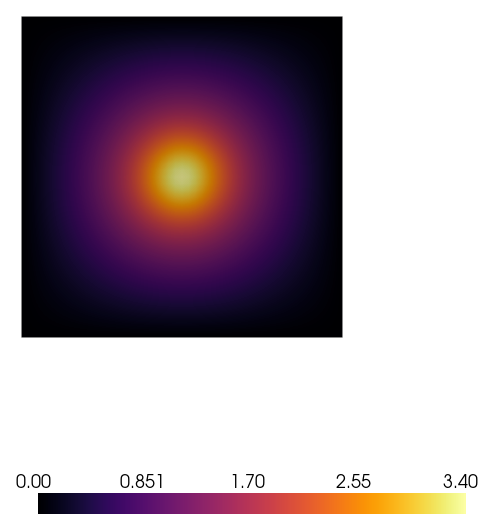
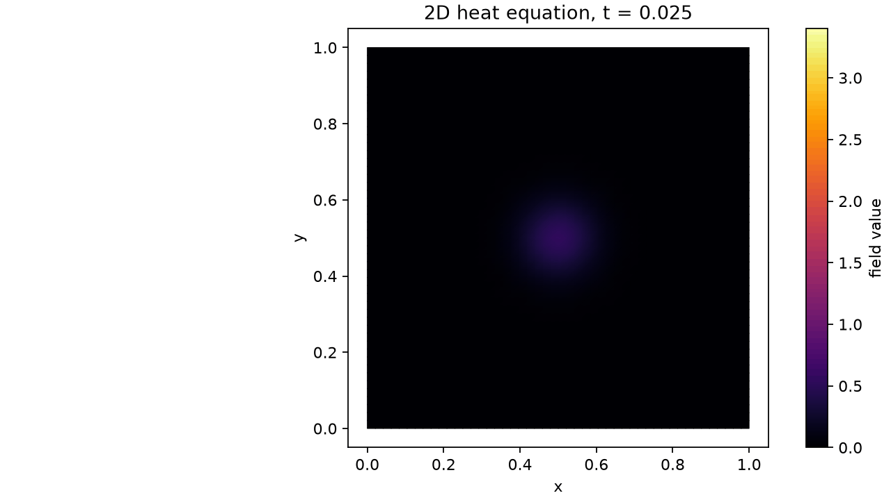
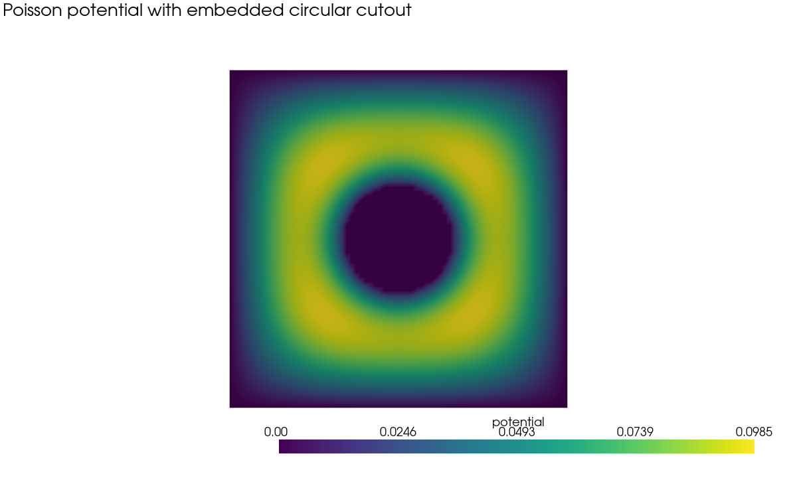
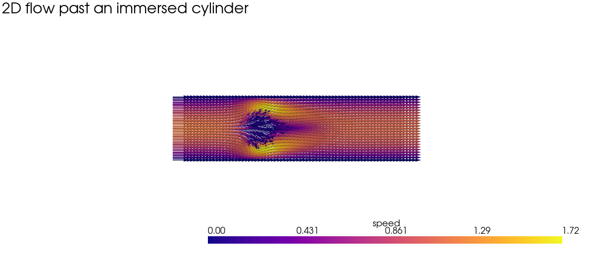
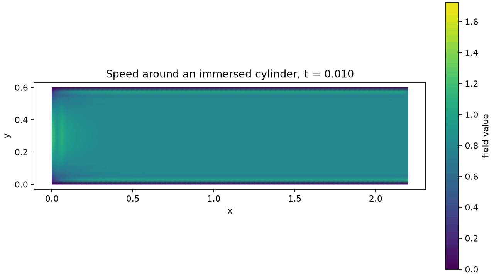

# DOLFINx Finite-Element Examples

Small, reproducible 2D finite-element examples. The code emphasizes readable
classes, separate problem modules, and committed visual artifacts.

## Packages

- DOLFINx 0.11.0 with PETSc, MPI4Py, and PETSc4Py
- PyVista 0.48.4 for screenshots
- Matplotlib and Pillow for animations

## Results

### Transient heat equation





`CenterHeatSimulation` solves the backward-Euler problem

$$
\frac{T^{n+1}-T^n}{\Delta t} - \kappa \nabla^2T^{n+1} = q(x,y),
$$

on the unit square with zero-temperature exterior boundaries. The Gaussian
source `q` is centered at `(0.5, 0.5)`. The saved GIF follows the field as it
approaches the source-driven steady state; the PNG is a PyVista off-screen
screenshot of the terminal field.

### Poisson equation with a circular cutout



`CircularCutoutPoissonSimulation` solves

$$
-\nabla^2 u = 10\sin(\pi x)\sin(\pi y)
$$

with zero exterior conditions and a zero-valued embedded circular region.
The installed environment does not currently include `gmsh`, so the circular
cutout is represented by strongly constrained P1 degrees of freedom inside
the disk, rather than a remeshed curved boundary. This is an immersed-boundary
demonstration, not a geometry-exact CAD mesh.

### 2D flow past an immersed cylinder





`CylinderFlowSimulation` advances a small incompressible projection method:

$$
\rho\left(\frac{u^*-u^n}{\Delta t} + (u^n\cdot\nabla)u^n\right)
- \mu\nabla^2u^* + \nabla p^n + \alpha\chi_{\mathrm{cylinder}}u^* = 0.
$$

then solves a pressure Poisson correction and updates the velocity. A
parabolic inlet and no-slip channel walls drive flow around the circular
immersed solid. The penalty term damps velocity inside the cylinder without a
separate mesh generator. The PNG is a PyVista screenshot with velocity glyphs;
the GIF is a Matplotlib animation of speed over time.

## Layout

```text
src/
  fea_portfolio/
    base.py           # simulation lifecycle and artifact paths
    heat.py           # transient diffusion/source model
    poisson.py        # embedded-cutout Poisson model
    flow.py           # projection-method cylinder flow model
    visualization.py  # PyVista screenshots and Matplotlib GIFs
  run_heat.py
  run_poisson.py
  run_flow.py
  run_all.py
images/               # generated, README-visible PNGs and GIFs
docs/                 # reserved for derivations and mesh studies
```
